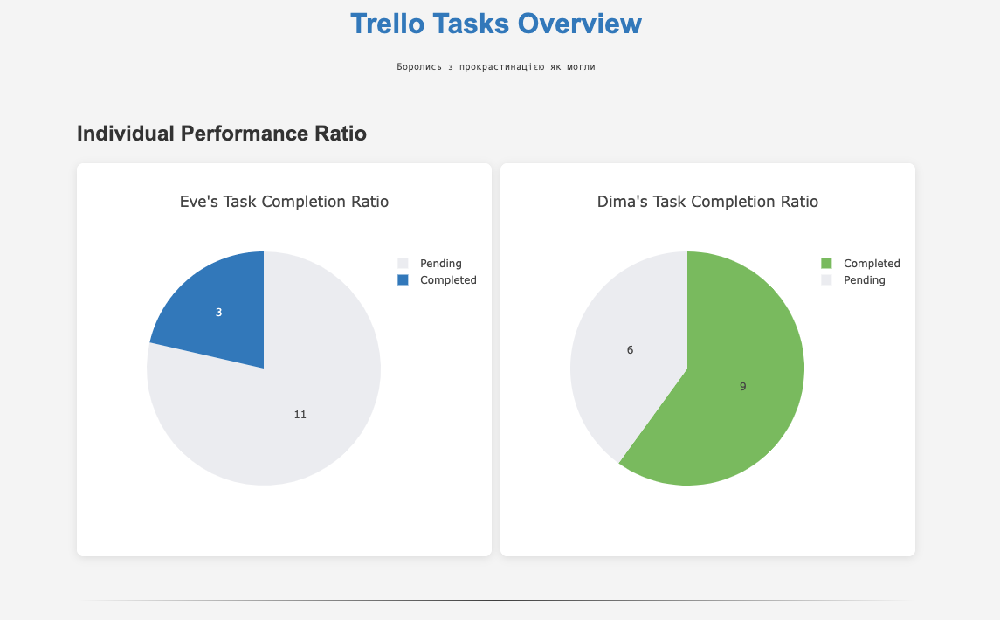

# Trello Done Tasks Tracker

## Overview
This tool was developed for personal use to help manage tasks with my partner more effectively. It's designed to track completed tasks on Trello, providing daily and weekly statistics for better productivity insights. Feel free to customize it to fit your needs.



## Features
- Track completed tasks from Trello boards
- View individual performance ratios with pie charts
- Analyze daily productivity trends (last 30 days)
- Monitor weekly task completion summary (last 12 weeks)
- Interactive charts powered by Plotly.js

## Getting Started

### Prerequisites
- Node.js
- npm
- A Trello account

### Getting Trello API Credentials

1. **Get your API Key and Token:**
   - Go to [https://trello.com/power-ups/admin](https://trello.com/power-ups/admin)
   - Create new PowerApp
   - Copy your API key
   - On the same page, click on the "Token" link
   - Authorize the application and copy the token

2. **Get your Board ID:**
   - Open your Trello board in a browser
   - The Board ID is in the URL: `https://trello.com/b/[BOARD_ID]/board-name`
   - Copy the Board ID part

### Installation
1. Clone the repository:
   ```bash
   git clone https://github.com/DreamerDeLy/trello-done-tracker.git
   cd trello-done-tracker
   ```

2. Install the dependencies:
   ```bash
   npm install
   ```

3. Create a `.env` file in the project root based on [`.env.example`](.env.example)

### Running the Application
1. Start the server:
   ```bash
   node app.js
   ```
2. Open your browser and go to `http://localhost:3000` to view the dashboard.

## How It Works
The application analyzes your Trello board and looks for:
- Lists containing "done" in their names (for completed tasks)
- Comments with "Done!" text to determine completion dates
- Lists containing "eve" or "dima" to categorize tasks by person
- Lists containing "today" or "week" for pending tasks

The tool generates statistics and visualizations based on this data structure.

## License
This project is licensed under the MIT License.
